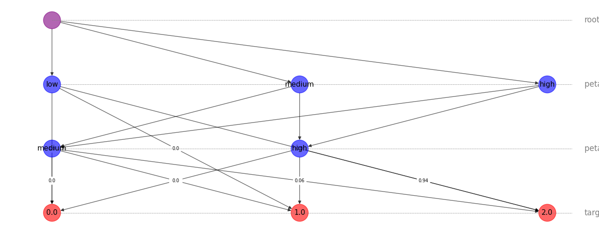
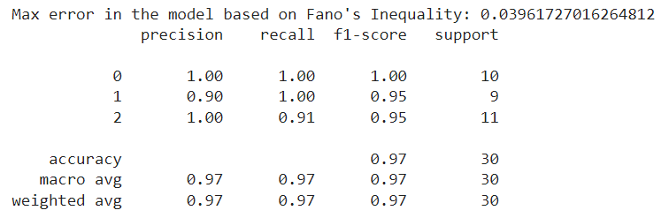

# Information Fuzzy Network (IFN) Model

The Information Fuzzy Network (IFN) model is designed to find the best attribute to split by at each level of the model. It works with both categorical and numeric attributes, ensuring that the splits maximize the mutual information between the input variables and the target variable. The model also implements Fano's Inequality to estimate the minimum prediction error. Each level of the model allows for one attribute split, meaning all nodes at that level will be split by the selected attribute if significant, or directed to the target nodes ('leaf' nodes) and determined as terminal.



The IFN model is useful for classification tasks. Below are the evaluation results on the Iris dataset, demonstrating good prediction performance on binned data.



Performance improves further with precise numerical attribute splits, but note that the runtime is significantly longer.

To start, run the following command in the terminal:

```
pip install -r requirements.txt
python main.py
```


## Key Features

1. **General Attribute Splitting**: Handles both categorical and numeric attributes, identifying the best attribute to split by at each level.
2. **Recursive Binning for Numeric Values**: Recursively finds the best splits for numeric attributes by evaluating the significance of each potential split.
3. **Significance Testing**: Uses chi-square tests to determine whether a split is meaningful and should be included in the final model.
4. **Fano's Inequality**: Implements Fano's Inequality to estimate the minimum prediction error.

## How It Works

### Initialization

The `IFN` class initializes with the training data, target variable, and a significance threshold. During initialization, it calls the `__init_create_bin_suggestions` method to determine the optimal binning thresholds for each numeric attribute, if any exist.

### Finding Best Attribute to Split

The model finds the best attribute to split by evaluating the mutual information gain for each attribute. It selects the attribute that maximizes the significance score (using the chi-square test) and uses it to split the data at each level. If a split is not significant, the test returns a score of 0.

### Recursive Splitting for Numeric Attributes

For numeric attributes, the model recursively finds the best splits by:
1. Identifying the unique values of the attribute.
2. Testing different thresholds to see how they split the data.
3. Ensuring the splits are meaningful by evaluating the significance using the `__significance_test` method.

## Available Public Methods

### IFN Class

- **`__init__(self, train_data, target, P_VALUE_THRESH, max_depth, weights_type)`**: Initializes the IFN model with the training data, target variable, and significance threshold. You can limit the depth to avoid overfitting (on edge cases) and weights_type controls the weights displayed when plotting.
- **`show(self)`**: Plots the network visualization of the IFN model using NetworkX.
- **`predict(self, df)`**: Predicts the target variable for a given dataframe using the trained IFN model.
- **`calculate_min_error_probability(self)`**: Assess the max error from the model, using the edge weight.
