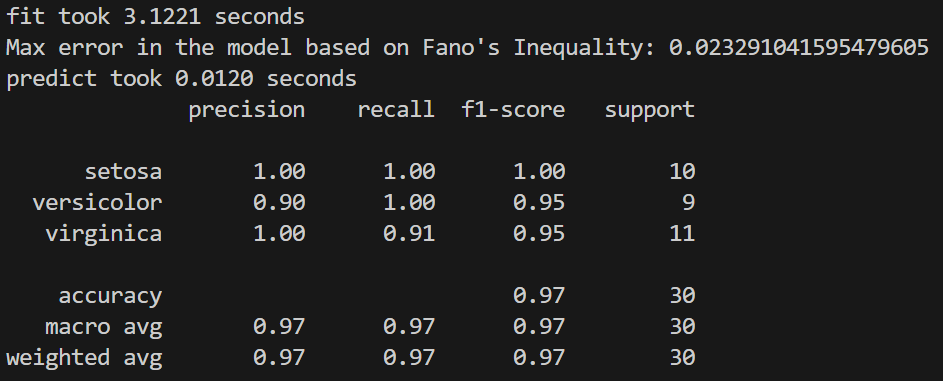

# Information Fuzzy Network (IFN) Model

The Information Fuzzy Network (IFN) machine learning model is designed to statistically find the best attribute to split by at each level of the model using chi-square test. It works with both categorical and numeric attributes, ensuring that the splits maximize the mutual information between the input variables and the target variable, while, unlike decision trees, split only when the improvement is significant. The model also implements Fano's Inequality to estimate the maximum prediction accuracy (min error) using the mutual information theory. Each level of the model allows for one attribute split, meaning all nodes at that level will be split by the selected attribute if significant, or directed to the target nodes ('leaf' nodes) and determined as terminal.

As shown in the viz, the built model resembles a "fully connected tree", and will choose the predicted class based on the majority rule at the terminal node.


The IFN model is useful for classification tasks usually handled with decision trees. It is a statisticaly stable model which performs feature selection in a built-in method, using chi test. 

Below are the evaluation results on the Iris dataset, demonstrating good prediction performance.



Train and prediction are possible on both categorical and numeric attributes, but note that the recursive optimal split detection on numeric ordinal variables can increase the runtime significantly, depends on the size of the data.

Target column can be either int or str, as long as it's descrete and has a reasonable amount of unique labels compared to the data size.

To start, run the following command in the terminal:

```
pip install -r requirements.txt
python main.py
```

## Key Features

1. **General Attribute Splitting**: Handles both categorical and numeric attributes, identifying the best attribute to split by at each level.
2. **Recursive Binning for Numeric Values**: Recursively finds the best splits for numeric attributes by evaluating the significance of each potential split.
3. **Significance Testing**: Uses chi-square tests to determine whether a split is meaningful and should be included in the final model.
4. **Fano's Inequality**: Implements Fano's Inequality to estimate the minimum prediction error.

## How It Works

### Initialization

The `IFN` class initializes with the training data, target variable, and a significance threshold. During initialization, it calls the `__init_create_bin_suggestions` method to determine the optimal binning thresholds for each numeric attribute, if any exist.

### Finding Best Attribute to Split

The model finds the best attribute to split by evaluating the mutual information gain for each attribute. It selects the attribute that maximizes the significance score (using the chi-square test) and uses it to split the data at each level. If a split is not significant, the test returns a score of 0.

### Recursive Splitting for Numeric Attributes

For numeric attributes, the model recursively finds the best splits by:
1. Identifying the unique values of the attribute.
2. Testing different thresholds to see how they split the data.
3. Ensuring the splits are meaningful by evaluating the significance using the `__significance_test` method.

## Available Public Methods

### IFN Class Methods

- **`__init__(self, train_data, target, P_VALUE_THRESH, max_depth, weights_type)`**: Initializes the IFN model with the training data, target variable, and significance threshold. You can limit the depth to avoid overfitting (on edge cases) and weights_type controls the weights displayed when plotting.
- **`show(self)`**: Plots the network visualization of the IFN model using NetworkX. NOTE: The plot represent "stronger" edges (higher probability) using darker colors, which should represent how a prediction will be made if a records "landed" in that node.
- **`predict(self, df)`**: Predicts the target variable for a given dataframe using the trained IFN model.
- **`calculate_min_error_probability(self)`**: Assess the min error from the model on unseen data, using the edge weight. To use properly, train the model on your full dataset and and call this method. This will provide an upper boundry to the model's accuracy on unseen data.
